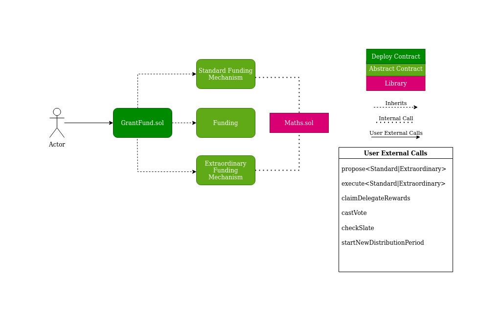

# Ajna Grant Coordination Fund

As a decentralized protocol with no external governance, Ajna requires a sustainable mechanism by which to coordinate ecosystem growth in a scalable and decentralized way. The grant coordination mechanism is premised upon the idea that the AJNA token has value from the buy and burn mechanism. Upon launch, the Ajna community will be given a fixed portion of the total AJNA token supply, which will be held and distributed by the Grant Coordination Fund.

| Deployment | Address |
| ---------: | ------- |
| Mainnet    | (net yet deployed) |
| Goerli     | [0xc9216387C7920C8a7b6C2cE4A44dEd5776a3B5B4](https://goerli.etherscan.io/address/0xc9216387C7920C8a7b6C2cE4A44dEd5776a3B5B4) |

## Design

The Grant Coordination Fund will distribute funds through the two sub-mechanisms defined below. It is based upon Openzeppelin's Governor contract.



### **Standard Funding Mechanism**

On a quarterly basis, a portion of the treasury is distributed to facilitate growth of the Ajna system.  Projects submit proposals for funding, denominated in a fixed amount of Ajna tokens, that are then voted on by Ajna token holders.  The result of this voting is binary: either the proposal wins and is funded with the requested tokens, or fails and receives nothing.  The overall set of approved proposals is decided upon by maximizing the number of votes for them, subject to an overall budgetary constraint.  The voting system has two stages: a screening stage, in which the list of possible winning projects is culled down to 10 candidates using a simple 1-token-1-vote method, and a quadratic voting stage, in which the actual winning projects are determined.

For more information, see the Ajna Protocol Whitepaper.

<br>

### **Extraordinary Funding Mechanism**

By meeting a certain quorum of non-treasury tokens, tokenholders may take tokens from the treasury outside of the SFM. This mechanism can be used to distribute much larger amounts of Ajna tokens, with the purpose of supporting large scale projects for the Ajna ecosystem.

This mechanism works by allowing up to the percentage over [50%] of non-treasury tokens, minimum threshold, that vote affirmatively to be removed from the treasury – the cap on this mechanism is therefore 100% minus the minimum threshold (50% in this case).

For more information, see the Ajna Protocol Whitepaper.


<br>

## Resources

### Governance Design Research:
*OpenZeppelin Guides*
- https://docs.openzeppelin.com/contracts/4.x/governance
- https://wizard.openzeppelin.com/#governor
- https://twitter.com/OpenZeppelin/status/1448054190631051266

*ENS*
- https://github.com/ensdomains/governance-docs/blob/main/process/README.md
- https://github.com/ensdomains/governance 

*HOP*
- https://github.com/hop-protocol/governance

*OP*
- https://github.com/ethereum-optimism/optimism/tree/develop/packages/contracts-governance

*General Governance Research*
- https://github.com/D3LAB-DAO/Governor-C
- https://www.daomasters.xyz/

*Multichain Governance*
- https://doseofdefi.substack.com/p/multichain-governance-how-can-daos
- https://github.com/gnosis/zodiac
- https://ethereum-magicians.org/t/eip-draft-multi-chain-governance/9284

*Quadratic Voting*
- https://github.com/VirginiaBlockchain/QuadraticVotingDapp
- https://blog.tally.xyz/a-simple-guide-to-quadratic-voting-327b52addde1

*Tally*
- https://docs.tally.xyz/user-guides/tally-contract-compatibility


## Deployment

See [README.md](../../README.md) for instructions using the `Makefile` target.

Output should confirm the AJNA token address, provid the GrantFund address, and the amount of AJNA which should be transferred to the GrantFund adress:
```
== Logs ==
  Deploying GrantFund to chain with AJNA token address 0xaadebCF61AA7Da0573b524DE57c67aDa797D46c5
  GrantFund deployed to 0xc9216387C7920C8a7b6C2cE4A44dEd5776a3B5B4
  Please transfer 600000000 AJNA (600000000000000000000000000 WAD) into the treasury
```

Record the deployment address in your environment as `GRANTFUND_ADDRESS`.  As requested, transfer the specified amount of AJNA tokens to the GrantFund address.  WAD-scaled value was included in output for copy/paste convenience.

To perform the transfer, set `TREASURY_ADDRESS` and `TREASURY_KEY` to the appropriate values and run the following:

```
cast send ${AJNA_TOKEN} "transfer(address,uint256)" ${GRANTFUND_ADDRESS} 600000000000000000000000000 --from ${TREASURY_ADDRESS} --keystore ${TREASURY_KEY} --rpc-url ${ETH_RPC_URL} 
```